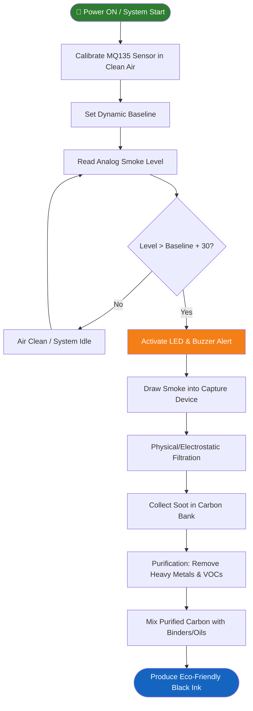

<div align="center">

# 🌍 Smoke to Ink Conversion System using Arduino UNO

### *IoT-Powered Eco-Friendly Pollution Reduction & Ink Production*

[](https://www.arduino.cc/)
[]()
[](https://en.wikipedia.org/wiki/Internet_of_things)
[]()
[](LICENSE)

> 🚀 **An innovative environmental initiative** that transforms harmful air pollutants—particularly soot from vehicle and industrial emissions—into usable ink products. This project aims to solve the twin problems of air pollution and harmful chemical use in ink production.

</div>

---

## 📋 Table of Contents

- [📌 Problem Statement](#-problem-statement)
- [💡 Solution & Approach](#-solution--approach)
- [🎯 Objectives](#-objectives)
- [🛠️ Technology Stack](#️-technology-stack)
- [📁 Project Structure](#-project-structure)
- [📐 Block Diagram](#-block-diagram)
- [🔬 How It Works — System Flowchart](#-how-it-works--system-flowchart)
- [🔌 Hardware & Circuit Setup](#-hardware--circuit-setup)
- [💻 Code Analysis](#-code-analysis)
- [🚀 Installation & Setup](#-installation--setup)
- [🎬 System Demo](#-system-demo)
- [🌍 Impact & Real-World Significance](#-impact--real-world-significance)
- [🔮 Future Enhancements](#-future-enhancements)
- [👨‍💻 Authors & Team](#-authors--team)
- [📚 References](#-references)

---

## 📌 Problem Statement

> **"Air pollution from rapid urbanization and traditional manufacturing leaves huge carbon footprints, harming both public health and global climate."**

### Background

Urban centers globally face severe air quality issues due to vehicular emissions and industrial activities. Burning fossil fuels releases harmful smoke and soot into the air, which contributes to climate change and severe respiratory issues.

### The Core Problem

| Challenge | Description |
|-----------|-------------|
| 🔴 **Toxic Pollutants** | High levels of particulate matter (PM2.5, PM10) from vehicle exhausts and chimneys. |
| 🔴 **Health Risks** | Inhalation of soot leads to respiratory problems, cardiovascular diseases, and more. |
| 🔴 **Harmful Ink Production** | Traditional ink production relies on carbon black from fossil fuels, contributing further to environmental degradation. |
| 🔴 **Waste Mismanagement** | Harmful carbon particles are allowed to disperse or are improperly dumped. |

---

## 💡 Solution & Approach

### Our Strategy

Instead of letting toxic soot escape into the atmosphere, this system captures it at the source, purifies it, and repurposes it.

1. **Emission Capture** — A collection device retrofitted to exhaust pipes, chimneys, or generators safely captures particulate matter.
2. **Soot Filtration** — A mesh filter or electrostatic precipitator separates the carbon content from normal gases.
3. **Purification Process** — Raw soot is washed with non-toxic solvents to remove heavy metals, carcinogens, and oily residues.
4. **Pigment Processing** — Cleaned carbon is dried and ground into an ultrafine powder.
5. **Ink Formulation** — Safe binders and eco-friendly oils are mixed with the carbon pigment to create high-quality black ink.
6. **Real-time Monitoring** — An Arduino UNO automates the detection of smoke density and system triggering.

---

## 🎯 Objectives

- ✅ **Capture up to 90-95%** of particulate matter from localized exhausts.
- ✅ **Automate smoke monitoring** and gas detection using MQ135 / MQ-2 sensors.
- ✅ **Detoxify soot** into a safe, usable pigment.
- ✅ **Formulate an eco-friendly ink** alternative for markers, printers, and screen printing.
- ✅ **Promote a circular economy** by turning hazardous waste into commercial value.

---

## 🛠️ Technology Stack

### Hardware Components

| Component | specification | Role |
|-----------|--------------|------|
| **Arduino UNO** | ATmega328P | Main microcontroller for monitoring & logic |
| **MQ135 / MQ-2** | Gas / Smoke Sensor | Detects smoke levels and gas density |
| **DC Fan / Motor** | 5V - 12V | Draws the exhaust smoke into the filter unit |
| **5V Relay Element**| Electromechanical | Safely switches higher voltage components |
| **LED & Buzzer** | 5V Active | Alerts when critical smoke levels are detected |
| **Power Supply** | 12V Battery | Sustains system portability & energy |
| **Filtration Chamber**| Heat-resistant | Contains mesh, cyclone, or electrostatic fields |

### Software Tools

| Software / Language | Purpose |
|---------------------|---------|
| **Arduino IDE** | Programming the embedded logic |
| **Embedded C / C++**| Core firmware for threshold detection |
| **Serial Monitor** | Debug logs & air quality statuses |

---

## 📁 Project Structure

```text
Smoke to Ink Conversion System using Arduino UNO/
│
├── 📄 Smoke Detected System.ino           # ⭐ Main firmware with auto-calibration
├── 📄 gas.ino                             # 🔧 Alternate basic code reference
│
├── 🖼️ Block Diagram of Smoke to Ink Conversion System.png
├── 🖼️ Demo Video of Smoke to Ink Conversion System.jpg
│
├── 📄 Report of Smoke to Ink Conversion System.pdf
├── 📄 Review PPT Smoke to Ink Conversion System.pdf
├── 📄 Paper to Pixel Smoke to Ink Conversion System.pdf
└── 📄 README.md                           # This documentation
```

---

## 📐 Block Diagram


---

## 🔬 How It Works — System Flowchart



---

## 🔌 Hardware & Circuit Setup

| Component Pin | Arduino UNO Pin | Signal |
|---------------|-----------------|--------|
| **MQ135 A0**  | **A0**          | Analog sensor reading |
| **MQ135 VCC** | **5V**          | Power |
| **MQ135 GND** | **GND**         | Ground |
| **LED Anode** | **Pin 11**      | Visual Alert Trigger |
| **Buzzer (+)**| **Pin 12**      | Audio Alert Trigger |

_Note: The fan or motor for collection requires external power routed through a relay or transistor to draw smoke in effectively._

---

## 💻 Code Analysis

### Main Program: `Smoke Detected System.ino`

#### Calibration Logic
The system automatically calculates the exact environmental baseline upon startup ensuring adaptability across various locations.

```cpp
long total = 0;
Serial.println("Calibrating MQ135 sensor... Please ensure clean air.");
for (int i = 0; i < 20; i++) {
  int reading = analogRead(mq135Pin);
  total += reading;
  delay(100);
}
baseline = total / 20; // Sets a dynamic clean-air threshold
```

#### Threshold Detection

```cpp
int sensorValue = analogRead(mq135Pin);

if (sensorValue > baseline + 30) {
  digitalWrite(ledPin, HIGH);
  digitalWrite(buzzerPin, HIGH);  // Activate alerts & start extraction
  Serial.println("⚠️ Smoke or Gas Detected!");
} else {
  digitalWrite(ledPin, LOW);
  digitalWrite(buzzerPin, LOW);   // Idle state
}
```

---

## 🚀 Installation & Setup

### Prerequisites
- [Arduino IDE](https://www.arduino.cc/en/software)
- Arduino UNO + USB cable
- MQ135 or MQ-2 Gas/Smoke sensor array

### Steps

1. **Clone the Repository** or download the `.ino` files.
2. **Open** `Smoke Detected System.ino` in Arduino IDE.
3. **Connect your hardware** based on the pin mapping above.
4. **Select Board:** `Tools → Board → Arduino UNO`.
5. **Select Port:** `Tools → Port → COMx`.
6. **Upload** the firmware to your board.
7. Open **Serial Monitor (9600 baud)** to view the calibration sequence and active sensor readings!

---

## 🎬 System Demo

### Working Prototype Setup Image
*(Demonstrates a smart city simulation converting vehicle fumes to ink in real-time)*


---

## 🌍 Impact & Real-World Significance

- 🌿 **Environmental Sustainability:** Curbs greenhouse gas emission levels and lowers air toxicity.
- ♻️ **Circular Economy:** Converts worthless, hazardous pollutants into sellable, highly sought-after ink (commonly adopted by artists, markers, and commercial printing).
- 🏥 **Health Improvements:** Significantly boosts neighborhood air quality, decreasing asthma and respiratory health crises.
- 💡 **Awareness:** Transforms a mundane product (ink) into a tangible representation of local climate-action.

---

## 🔮 Future Enhancements

- [ ] **IoT Dashboard Integration** (via ESP8266/ESP32) for live AQI mapping and soot collection progress in the cloud.
- [ ] **Mobile App** alerts when soot collection reservoirs reach optimal levels for harvesting.
- [ ] **Improved Automation:** Intelligent motor speed controls adapting to exhaust output volume dynamically.
- [ ] **Deeper Chemical Processing** to generate varied opacity and shades of carbon ink autonomously.

---

## 👨‍💻 Authors & Team

**Team Solvix**
- **Arokiya Nithish J**
- **Ishwarya M**
- **Affiliation:** Vel Tech University
- **Theme:** Smart Cities / Smart Automation

**Contact:**
- GitHub: [@ArokiyaNithish](https://github.com/ArokiyaNithish)

---

## 📚 References

1. Project Design Report: *Report of Smoke to Ink Conversion System*
2. *Paper to Pixel Smoke to Ink Conversion System* (Presentation)
3. Arduino UNO Official Documentation
4. Sustainable Cities and Communities (UN SDG Context)

<div align="center">

🌟 **Empowering a Greener Future through Embedded Logic and Chemistry!**

</div>
